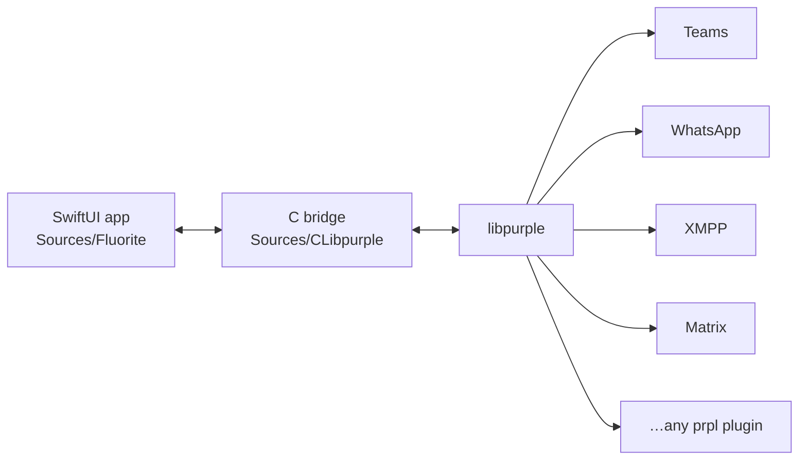

<div align="center">


# Fluorite

### Every chat network. One native Mac app.

**Teams, WhatsApp, XMPP, Matrix and any other libpurple protocol in a single
SwiftUI window.** Fluorite is a Swift 6 rewrite of [Adium](https://adium.im),
built on the same engine that made Adium possible:
[libpurple](https://developer.pidgin.im/wiki/WhatIsLibpurple).

[](#install)
[](Package.swift)
[](Sources/Fluorite)
[](LICENSE)
[](#roadmap)
[](#contributing)
[](https://github.com/kryjex/fluorite/stargazers)

</div>


---

## Why Fluorite

Adium proved one thing for a decade: a single **native** Mac app can speak every
chat network at once, and it beats running five Electron clients that each eat a
gigabyte of RAM. That idea never stopped being right — the twenty-year-old
Objective-C codebase around it just stopped being fun to work on.

Fluorite keeps the idea and replaces everything above the protocol layer.

|                       | Classic Adium                | Fluorite                                            |
| --------------------- | ---------------------------- | --------------------------------------------------- |
| **Codebase**          | Objective-C, ~20 years of it | Swift 6, strict concurrency, SwiftUI                 |
| **Protocol engine**   | libpurple                    | libpurple — the same one                             |
| **Protocol plugins**  | compiled into the app        | installed in-app from a catalog, pinned by SHA-256   |
| **Teams / WhatsApp**  | never shipped                | first-class, out of the box                          |
| **Automation**        | AppleScript                  | App Intents — Shortcuts, Spotlight, Siri             |

Your existing Adium data comes with you: `.chatlog` transcripts,
`.AdiumEmoticonset` packs and `.AdiumSoundset` sound sets all import.

## Supported services

| Service                                   | How it gets there                                       | Status |
| ----------------------------------------- | ------------------------------------------------------- | ------ |
| **Microsoft Teams** (work/school)         | `purple-teams` from the in-app catalog                  | ✅     |
| **Microsoft Teams** (personal accounts)   | `purple-teams` from the in-app catalog                  | ✅     |
| **WhatsApp**                              | `purple-gowhatsapp` — real whatsmeow, QR device pairing  | ✅     |
| **XMPP / Jabber**                         | bundled with the app                                    | ✅     |
| **Matrix**                                | `purple-matrix` from the catalog, E2EE rooms via libolm  | ✅     |
| **IRC, Bonjour, SIMPLE, GroupWise, …**    | libpurple's own plugins, from Homebrew's `pidgin`        | ⚙️     |
| **Anything else with a `prpl`**           | drop the `.so` into `~/.fluorite/plugins`                | ✅     |

The catalog lives in a separate repo,
[adium-plugins-catalog](https://github.com/kryjex/adium-plugins-catalog), which
builds each plugin in CI and publishes the binary with its checksum. Fluorite
verifies that checksum before it installs anything.

## Features

- **Multi-account routing** across every protocol at once — combined contacts,
  metacontacts, groups, activity sorting, presence and custom status messages.
- **Tabbed conversations**, group chats and channels (MUC), typing indicators,
  buddy icons, file transfer with a transfer window.
- **Message styles** — Bubbles, Compact or Classic Lines.
- **Transcripts** — searchable, filterable, exportable to plain text, JSON or HTML.
- **Events engine** — per-event sounds, Dock bounce and badges across 10 event
  types, from *message received* to *mention in group chat*.
- **Menu bar extra** — flip your status or read the unread total straight from
  the menu bar, without bringing a window forward.
- **Shortcuts / App Intents** — send a message, set your status or list contacts
  from Shortcuts, Spotlight or a keyboard trigger.
- **Backup & restore** — one zip with your data and logs, passwords stripped out.
- **Localized in 8 languages** — English, Spanish, German, Swedish, Norwegian,
  Italian, French and Russian, with an in-app language override.
- **Teams calls** open the Teams web client in a `WKWebView`; everything else is
  native SwiftUI. Fluorite does not implement WebRTC.

### Private by construction

No telemetry, no analytics, no accounts on our side — there is no *our side*.
Passwords live in the macOS Keychain, transcripts and settings stay in
`~/.fluorite/`, and every backup is sanitized before it leaves the machine.

## Install

### [⬇ Download Fluorite](https://github.com/kryjex/fluorite/releases/latest)

Signed with a Developer ID and notarized, so it opens on a double-click —
no Gatekeeper warning, no right-click dance. Apple silicon, macOS 14 or later.
Drag it into `Applications` and add your first account.

### Build from source

```bash
brew install pidgin glib json-glib gettext   # pidgin brings libpurple + its protocol plugins
git clone https://github.com/kryjex/fluorite.git
cd fluorite
make run
```

That needs macOS 14 or later and a Swift 6.3 toolchain. Other targets:

```bash
swift build     # compile
swift test      # run the suite — 100+ tests, fast, no network
make app        # build build/Fluorite.app with plugins, Info.plist and codesign
make install    # copy it to ~/Applications
```

> Camera and microphone only work from the app bundle (`make app`). A bare
> `swift run` has no `Info.plist`, so macOS denies media capture.

## How it works



`PurpleBridgeService` is a single `@MainActor @Observable` object that owns all
app state and receives every libpurple event. The C bridge marshals both ways:
libpurple is not thread-safe, so every mutation is scheduled onto the GLib loop,
and every callback copies its strings before hopping back to the main queue.

## Roadmap

- [ ] First signed release on the Releases page
- [ ] Live QA against real Teams tenants, XMPP servers and WhatsApp pairings
- [ ] WhatsApp session persistence across restarts
- [ ] More protocols in the catalog — Signal, Discord, Google Chat
- [ ] Full parity sweep against the classic Adium feature set

## Contributing

Issues and PRs are welcome, and some of the best entry points need no Swift at all:

- 🌍 **Translations** — one JSON file per language in `scripts/l10n/`. Add or fix
  a language and run `python3 scripts/gen-l10n.py scripts/l10n Sources/Fluorite/Resources Packaging`.
- 🔌 **Protocol plugins** — write a libpurple `prpl` with `Plugins/PLUGIN_GUIDE.md`
  and propose it in the [catalog repo](https://github.com/kryjex/adium-plugins-catalog).
  Plugins are **not** vendored here; only the glue code lives in `Sources/`.
- 🎨 **Message styles, sounds, emoticon packs** — classic Adium formats work as-is.
- 🧠 **Swift and C** — `AGENTS.md` is the source of truth for architecture, the
  i18n and a11y rules, and the C bridge safety rules. Read it first.

The repo is set up for coding agents too: `AGENTS.md` is shared by every harness,
and `.claude/` adds hooks, a C-bridge reviewer and one translator subagent per
language.

## Credits

Fluorite stands on the [Adium](https://adium.im) team's work, on
[libpurple](https://developer.pidgin.im/wiki/WhatIsLibpurple) and Pidgin, and on
the plugin authors who keep the modern networks reachable:
[EionRobb](https://github.com/EionRobb/purple-teams) (Teams),
[hoehermann](https://github.com/hoehermann/purple-gowhatsapp) (WhatsApp), and
[matrix-org](https://github.com/matrix-org/purple-matrix) (Matrix).

## License

GNU General Public License v2, inherited from Adium. See [`LICENSE`](LICENSE).

<div align="center">

**If you miss Adium, ⭐ the repo — it is the cheapest way to help this get finished.**

</div>
