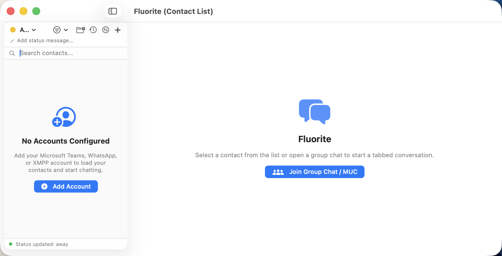

# Fluorite



Fluorite is a multi-protocol instant-messaging client for macOS. It is a
Swift 6 rewrite of [Adium](https://adium.im), built on the same underlying
engine Adium used: the
[libpurple](https://developer.pidgin.im/wiki/WhatIsLibpurple) protocol
library. A SwiftUI app talks to a small C bridge, and the C bridge talks to
libpurple and its protocol plugins.

## Supported services

- Microsoft Teams
- WhatsApp
- XMPP / Jabber
- Matrix
- IRC
- Bonjour (local network, no account needed)
- Any other libpurple protocol plugin, installed through the built-in
  [plugin catalog](https://github.com/kryjex/adium-plugins-catalog)

## Features

- **Multi-account routing** across every supported protocol, with combined
  contacts, activity-based sorting, and presence.
- **Tabbed conversations**, group chats / channels (MUC), and file transfer.
- **Message styles**: Bubbles, Compact, or Classic Lines.
- **Transcripts**: search, filter, and export to plain text, JSON, or HTML.
- **Events engine**: sounds, Dock bounce, and badges per event type.
- **Shortcuts support** (App Intents): send a message, set your status, or
  list contacts from Shortcuts or Spotlight.
- **Classic Adium data import**: bring over `.chatlog` XML transcripts,
  `.AdiumEmoticonset` emoticon packs, and `.AdiumSoundset` sound sets from a
  classic Adium install.

## Build and run

```
swift build   # compile
swift test    # run the test suite (fast, no network)
make app       # build build/Fluorite.app with plugins, Info.plist, and codesign
make run       # build and open the app
make install   # copy build/Fluorite.app to ~/Applications
```

Camera and microphone features only work from the app bundle (`make app`); a
bare `swift run` has no `Info.plist`, so macOS denies media capture.

See `AGENTS.md` for the full architecture, coding conventions, and the C
bridge safety rules — it is the source of truth for every contributor and
coding agent working in this repository.

## Contributing

Protocol plugins (Teams, WhatsApp, and any other libpurple plugin) are not
vendored in this repository. See `Plugins/PLUGIN_GUIDE.md` to write one, and
propose it upstream in the
[plugin catalog](https://github.com/kryjex/adium-plugins-catalog).

## License

GNU General Public License v2, inherited from Adium. See `LICENSE`.
